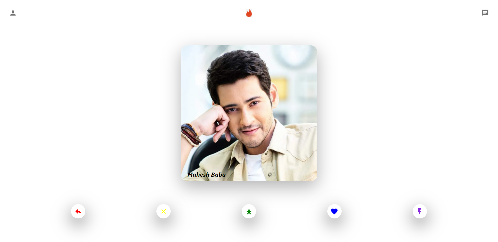

# Tinder Clone

A simple mini MERN app where one can find persons near by you.

## Screenshots

<p>
    
</p>

## Tech Stack

**FrontEnd** - [React](https://reactjs.org/)

**State Mangement** - [React Hooks](https://reactjs.org/docs/hooks-intro.html) (useState, useEffect)

**Responsive Design** - [Flex Box](https://css-tricks.com/snippets/css/a-guide-to-flexbox/)

**Server** - [NodeJs](https://nodejs.org/api/) ([Express](https://expressjs.com/))

**Database** - [MongoDB](https://www.mongodb.com/docs/) ([Mongoose](https://mongoosejs.com/))

**Animating Cards** - [react-tinder-card](https://www.npmjs.com/package/react-tinder-card) (Node Package)

**Icons** - [Material UI](https://mui.com/material-ui/material-icons/)

- other important Node packages used in this project : axios, cors, nodemon, dotenv

## Environment Variables

To run this project, you will need to add the following environment variables to your .env file

`MONGODB_URL` - Connection String used to connect Server and MongoDB

`PORT`

## Features

- Get persons data from Mongodb Database
- Add persons data into Mongodb Database
- Responsive Design

_More Features are Loading...._

## Run Locally

Clone the project

```bash
  git clone https://github.com/Geyanth08/Tinder_Clone.git
```

Go to the project directory

```bash
  cd my-project
```

**Client Setup**

```bash
 cd client
```

Install dependencies

```bash
  npm install
```

Start the react app

```bash
  npm run start
```

\*\*Server Setup"

```bash
 cd server
```

Install dependencies

```bash
  npm install
```

Start the server

```bash
  npm run start
```

**NOTE** - Check Whether the PORT number (default is `8000`) in axios file of Client folder and PORT Variable in .env file of server folder are **same**

## See You Soon 🤩

If you have any feedback or suggestions, please feel free to reach me out - [Geyanth08](https://github.com/Geyanth08)
